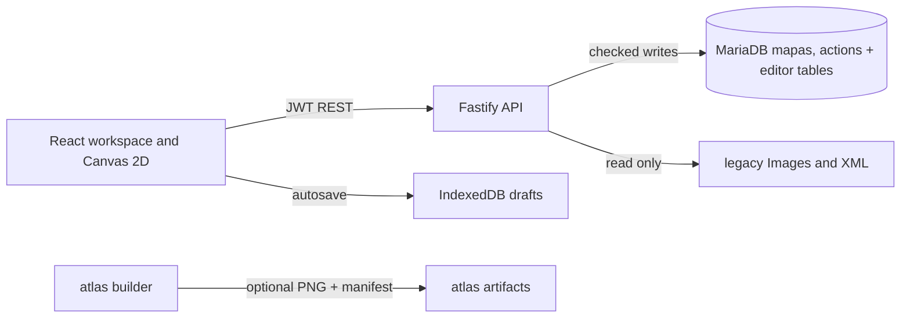

# Technical specification and delivery plan

## 1. System boundary

The browser edits a versioned `MapDocument` and sends it to a single Fastify API. The API validates the current edit lease, `expectedVersion`, and a fingerprint of the emulator rows, then writes the JSON document and Atlanta `mapas` projection. It stores thumbnail PNGs, history, audit data, and a prewrite database snapshot. The emulator map/action tables are MyISAM, so their writes cannot form one atomic transaction with the InnoDB editor tables. All API responses are JSON except PNG thumbnails and the explicit SQL download. The React client never sends SQL for execution.

Technology: Node.js 22.12+, React 19, TypeScript 5.9, Vite 8, Zustand 5, Fastify 5, MariaDB 10.4.32 on the supplied XAMPP host, Vitest 4. The runtime versions are locked in `package-lock.json` after installation. Sources: [Vite guide](https://vite.dev/guide/), [Fastify validation](https://fastify.dev/docs/latest/Reference/Validation-and-Serialization/), [Canvas 2D API](https://developer.mozilla.org/en-US/docs/Web/API/CanvasRenderingContext2D).

## 2. Data contracts

The executable TypeScript interfaces, factories and validation rules are in `src/domain.ts`. DDL is in `server/schema.sql`. The API contract is `openapi.yaml`.

| Entity | Key fields | Persistence |
| --- | --- | --- |
| MapDocument | `format`, `schemaVersion`, `id`, `width`, `height`, `cells`, background/music/ambiance/outdoor/capabilities, geoposition, combat, `nextRoom/nextCell`, key, version, author/timestamps | `editor_map_documents.document_json` |
| Cell | `id`, `gfx1/2/3`, seven flags, `fightCell`, `nivSol`, `inclineSol`, three rotations/flips, optional raw data and trigger target | Inside document JSON; selected fields projected to `mapData` and `posPelea` |
| TileAsset | `id`, `type` 0 ground / 1 object / 2 background, pack, URL, origin x/y | Discovered from `Images/`; origins from legacy XML |
| Edit lease | `map_id`, `owner`, expiry | `editor_locks` |
| Revision | `(map_id, version)`, document, author, saved time | `editor_map_versions` |
| Audit event | actor, action, map, JSON details, timestamp | `editor_audit` |

Dimensions must be integers 2–100; defaults are 15×17. Cell count is `height * (width*2 - 1) - width + 1`; default is 479. Every `cells[i].id` equals `i`. A new map blocks top/bottom long rows and their left/right edge cells, and requires at least one walkable cell. Existing emulator maps may contain blocked fight positions or trigger-type cells without an action, so import retains them. Newly painted fight cells must fit two legacy characters. Gfx1 must be 0–2047; Gfx2/Gfx3 0–16383. Ground levels and slopes are 0–15. On save the API checks changed linked destinations against live `mapas` dimensions.

### Legacy encoding

Alphabet: `abcdefghijklmnopqrstuvwxyzABCDEFGHIJKLMNOPQRSTUVWXYZ0123456789-_`. `mapData` contains exactly 10 characters per cell. `src/legacy.ts` implements both directions with the bit layout from `Builder.vb`/`Map.vb`, preserves unedited active and movement bits, and optionally decrypts genuine encrypted data. `posPelea` consists of two base-64 digits per cell ID for team 1, `|`, then team 2, sometimes followed by a color component. Original ordering and empty forms are preserved. There is no PNG, trigger destination, author, super-area, background music or full combat action inside those 10 characters; those values live in other columns, related tables, or editor JSON.

## 3. Rendering and interaction

Each long row has `width` diamonds and each intermediate short row has `width-1`. With half-cell `s=26`, long-row cell `(row,col)` centers at `(s+2s*col, s*row+s/2)`; short-row cell centers at `(2s+2s*col, s*row+s)`. A diamond has horizontal radius `s` and vertical radius `s/2`. Default logical canvas bounds are `width*2*s` by `height*s`. Pointer coordinates invert the current pan/zoom matrix, then diamond containment determines the cell.

Rendering order: background; all Gfx1; all Gfx2; all Gfx3; cell-mode color overlays; grid, IDs, selection and hover. Image cache loads individual PNGs asynchronously and invalidates the canvas when an image completes. Sprite origins are taken from legacy XML. The viewport excludes cells outside its bounds with 220 px overscan for tall objects. The canvas uses device pixel ratio and CSS sizing. `makeThumbnail` and `makeCellThumbnail` use the same renderer on offscreen canvases; map save sends the resulting PNG data URLs to the server.

The currently implemented Canvas 2D renderer is in `src/render.ts` and the pointer tool controller is `src/MapCanvas.tsx`. `scripts/build-atlas.ts` packs images by type/pack into 2048×2048 PNGs and emits `atlas/manifest.json`, separating atlas crop coordinates from per-sprite origins. `ASSET_BASE_URL` can point image requests to a CDN; that CDN must allow cross-origin image loading if canvas PNG export is used. Atlas use in the live renderer requires an additional measured optimization pass.

### Editor state

`src/store.ts` holds tabs, active document, tool, layer, selected IDs, tile selection, brush transform, view toggles, zoom/pan and link source. Edits clone a document and push up to 50 history snapshots. A pointer sweep groups its mutations as one undo step. `Ctrl+Z/Y`, `Ctrl+C/V`, `F`, `R`, `Delete`, and `Escape` are handled while focus is outside text inputs. Keyboard copy/paste preserves flattened cell-ID offsets; it does not yet preserve arbitrary geometric selections across different map widths.

| Tool | Left click / sweep | Right click | Constraints |
| --- | --- | --- | --- |
| Brush | Paint selected tile into active layer with rotation/flip and brush radius | Clear that layer | Ground tiles belong to layer 1; objects to 2 or 3 |
| Selector | Select a cell; Shift adds/removes from selection | No action | Inspector edits selected cells |
| Cell mode | Set unwalkable, block LoS, path, paddock, team 1/2 | Clear chosen property | Fight paint skips blocked cells |
| Trigger | First click source, second click destination on any open tab | No action | Source tab needs edit lease |
| End fight | First click source, second click destination on another open tab | No action | Source/destination map IDs differ |

The inspector can edit each flag, fight team, ground values, trigger target, all map metadata, global tile delete/replace, and layer deletion. The world grid shows one area at a time, lets the operator assign the active map's X/Y and export the current view as PNG. The monster selector appends IDs to the raw server-format field; semantic server-specific mob grammar is deliberately left to an adapter.

## 4. API and authorization

Endpoints are defined in `openapi.yaml`. Main flow:

1. `POST /api/auth/login` returns an 8-hour JWT with subject and role. An admin account is created from environment variables on first boot; later password changes must use a database migration or administration tool.
2. `GET /api/maps` lists editor documents. `GET /api/legacy/maps` lists legacy rows not yet imported.
3. `POST /api/maps` creates a map and grants the caller a 120-second lease. `PUT /api/maps/{id}/lock` acquires/renews, `DELETE` releases.
4. `PUT /api/maps/{id}` validates data, version, lease, subarea hierarchy, and source fingerprint, saves the supported emulator rows, and returns the new document version. 409 means stale version or outside database change; 423 means no valid lease; 422 means validation failed.
5. `POST /api/legacy/maps/{id}/import` reconstructs a JSON document from `mapas` and its supported related action rows. `POST /api/legacy/swf/decode` parses a bounded Astria FWS/CWS upload but does not save it until a new map is created.
6. `GET /api/tiles` pages asset metadata. `/api/areas`, `/api/subareas`, `/api/monsters` read Atlanta database tables. `/api/world` provides live `mapas` geolocation points. `/api/maps/{id}/legacy-sql` downloads one `mapas` statement.

Tokens remain in browser session storage. Passwords are salted scrypt hashes. `npm run user:create` provisions viewer/editor/admin accounts from environment variables. API rate limits are global 120 requests/minute and 10 login attempts/minute. All writes use parameterized SQL; the SQL download is escaped text and is never executed by the browser. Static asset PNGs are read only; account security still requires TLS, secure deployment settings and routine backups.

## 5. Save, recovery and conflict behavior

The client uses IndexedDB for a 30-second dirty-draft autosave and saves dirty tabs on close. On open, it offers to restore a local draft only when its `version` matches the server version and its saved time is newer. Saves create normal and cell-mode PNG thumbnails, calculate used Gfx IDs, then send document, version and PNGs. On 409/423, the client retains the local draft and blocks silent overwrite. Version history is append-only. The map inspector can load an old version as a new unsaved draft; three-way conflict merge is future work.

The emulator SQL projection is updated by `writeProjection` using all 23 `mapas` columns. It retains an imported key and preserves unedited packed data. The renderer's JSON export is `.astria.json`. SQL export is one `mapas` row. The live API also handles simple `celdas_accion`, `accion_pelea`, and `mobs_fix` edits while preserving unrelated rows; see `docs/ATLANTA_ADAPTER.md`. SWF export is retired.

## 6. Migration procedure

1. Back up the source MySQL database and old `Images/`, `XML/`, `Maps/` trees. Test restoration.
2. Run the API's additive `editor_*` DDL in a staging copy. Existing `mapas` rows remain untouched until a map is created or saved. The API checks the exact Atlanta column names at startup; `server/schema.sql` creates only editor tables.
3. For each legacy row, use `GET /api/legacy/maps`, then `POST /api/legacy/maps/{id}/import`. Compare decoded cell count, `mapData` re-encode, `posPelea`, and geographic position. Import creates an editor document without rewriting the game row.
4. For map metadata absent from the DB, import the corresponding Astria-generated SWF in a fresh ID or enrich the imported JSON with a trusted converter. Import SWF only from trusted local files. `.ame` requires an offline trusted exporter because it is BinaryFormatter.
5. Compare representative maps by PNG, collision flags, team cells, and area placement. Use a disposable schema copy to verify action writes before publishing to the live emulator.
6. Cut over only after backups, operator sign-off, and a rollback rehearsal. Rollback means restore the DB snapshot; do not assume an editor JSON rollback rewrites all game-server tables.

## 7. Verification and acceptance gates

Automated checks currently provided: Vitest topology/border validation, codec round-trip, FightPlaces validation, legacy DB-row import, bundled SWF import, and TypeScript/Vite build. Live MariaDB schema introspection covered all three emulator databases. An integration run on a disposable copy verified a no edit save of all 23 map columns, related action create/delete, and stale source rejection. Browser E2E, visual regression, and load testing remain open release gates.

| Release gate | Test method | Pass criterion |
| --- | --- | --- |
| Geometry and codecs | Vitest + 20 legacy fixtures | Exact cell count, IDs, 10-character/cell projection, fight teams, no lossy supported fields |
| CRUD and conflict | Integration test against Atlanta MariaDB copy | Create/open/save/reopen; external map change returns 409; expired/foreign lease returns 423 |
| Tools | Playwright interaction on 15×17 and custom map | Brush/erase/layers, selector, cell modes, links, history, multi-select, copy/paste all persist after reopen |
| Images | Screenshot comparison at 100% and 200% zoom | Cell geometry and layer order match approved reference images; thumbnails include normal/cell modes |
| Import | Fixture DB rows and bundled SWFs | Recover expected dimensions, position, flags and metadata; unsupported input rejected with 4xx |
| Accessibility | Keyboard + screen reader audit | Every form control has a label; selected cell can be edited without canvas pointer |
| Performance | Chrome profiler on target hardware | At 15×17: interaction ≥60 FPS after images load; initial map view <2 s on local LAN; client memory <250 MB. At 50×50: ≥30 FPS while panning. Adjust engine/atlas if not met. |
| Security | Dependency audit + API penetration review | No high/critical dependency advisories; unauthorized save 401/403; path and payload limits enforced |

## 8. Roadmap and completion status

| Phase | Deliverable | State |
| --- | --- | --- |
| 0 | Legacy audit, decisions, contracts, codec | Implemented; targeted unit tests pass |
| 1 | Map CRUD, tabs, tools, canvas renderer, local drafts | Implemented, database/browser integration pending |
| 2 | Asset packs, XML origins, atlas output, world/mob controls | Implemented as described; atlas rendering pending |
| 3 | Expand Atlanta action editor for multiple conditional actions and bulk migration | Preserve every unsupported row until its UI and semantics are verified |
| 4 | Auto conflict merge, full i18n, screen-reader grid model | Planned; manual revision restoration is available |
| 5 | Playwright/visual/load suites and production deployment | Planned; Docker daemon unavailable in this environment |

This is a working implementation and a concrete migration base. It is not yet a claim that all original acceptance criteria, especially server-specific game actions and production performance, have passed.
